# 回声（Echo）

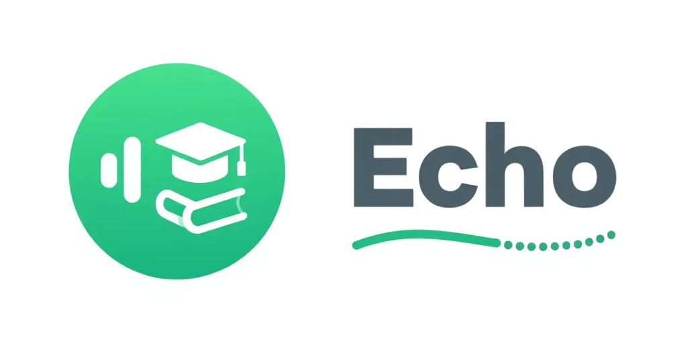

## 🎯 项目简介

回声（Echo）是一个交互式考试平台，其灵感直接来源于我的母校的入学考试与每学期的英语口语机考。尽管每次临近口语考试，临时抱佛脚背课文都十分痛苦，现在想来却不得不感谢当时打下的英语基础。没有白背的课文，也没有白练的口语，中学时学到的英语能力，换来了免修大学英语、无障碍阅读外文文献与更大更广阔的世界。

一般机考常依赖人工评分，并且考试结束无详细反馈，不利于作为学习工具。本项目借助全模态模型（默认为Qwen3-Omni-Flash）的能力自动化地提供即时反馈与详细的解析，让大模型成为你的“回声”，配合你快速进步。

### 核心功能

- 🔄 **智能导入**：支持PDF、Word、图片等多种格式，自动转换为标准化考试题目
- 🤖 **AI评分**：使用大语言模型进行智能评分和反馈，即时显示成绩和详细解析
- 🗣️ **语音合成**：将文字转换为自然语音
- 📝 **多种题型**：选择题、朗读练习、快速回答、翻译题

## 📖 使用说明

### 安装指南

1. 确保您的操作系统为Windows 10+或Linux,且有互联网连接
2. 从 [GitHub Releases](https://github.com/Mtrya/echo/releases) 下载最新版本的 `echo.exe`（Windows）或 `echo`（Linux）
3. 双击运行程序（Windows）或`cd`到文件所在文件夹运行`./echo`（Linux）
4. 程序会自动在系统目录创建必要的配置文件夹

### 🚀 第一次使用指南

#### 步骤1：启动程序

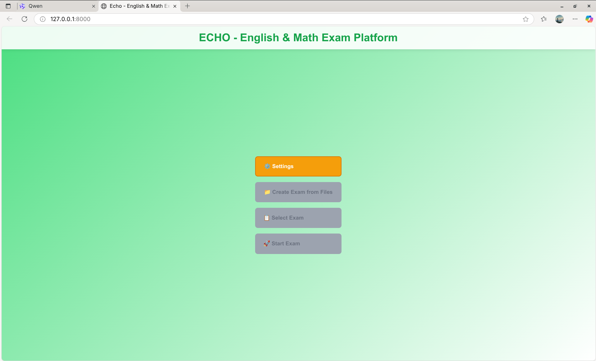
*图1：程序打开后的初始主页界面*

1. **双击运行** `echo.exe`（Windows）或在终端运行 `./echo`（Linux）
2. 程序会先显示命令行界面，几秒钟后自动打开浏览器
3. 如果浏览器没有自动打开，请手动打开浏览器访问 `http://localhost:8000`

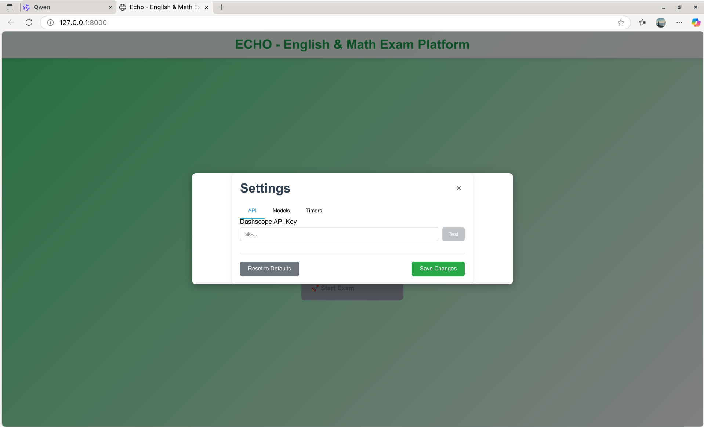
*图2：设置页面，需要输入DASHSCOPE API密钥*

> 💡 **提示**：如果没有DASHSCOPE API密钥，请访问 [阿里云Dashscope控制台](https://dashscope.aliyun.com/) 获取。新用户有免费额度。

#### 步骤2：配置API密钥

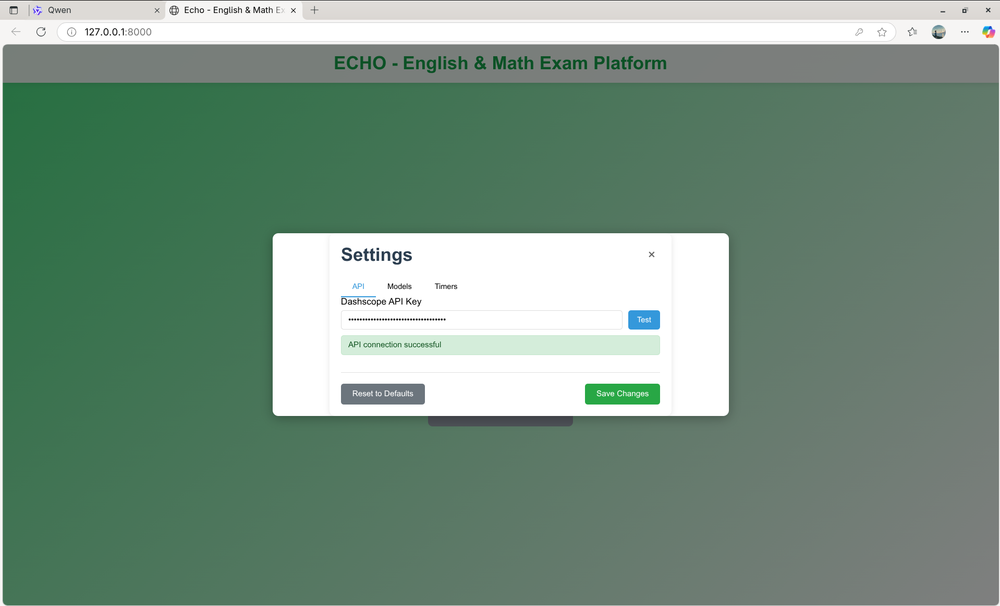
*图3：点击测试连接按钮*

1. **点击设置按钮**：页面上方的⚙️设置按钮（橙色闪烁提示）
2. **进入设置页面**：看到设置弹窗，包含API、模型、计时器三个标签页

3. **输入API密钥**：
   - 切换到"API"标签页
   - 在"DASHSCOPE API密钥"输入框中输入您的密钥
   - 密钥会以圆点形式隐藏显示

4. **测试连接**：
   - 点击"测试连接"按钮
   - 如果密钥正确，会显示绿色的"连接成功"提示
   - 如果密钥错误，会显示红色的错误信息

5. **保存设置**：
   - 点击"保存设置"按钮
   - 设置会自动保存，页面返回到主页
   - 现在所有功能都已解锁，可以开始使用Echo了！

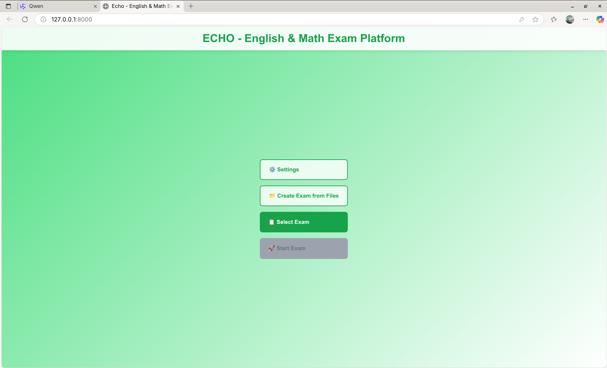
*图4：配置完毕返回到主页，所有功能已解锁*

### 📝 完整考试流程

#### 步骤1：选择一份试题

您必须选择一份试题，才能开始考试，点击”选择试题“按钮以选择试题。默认显示未完成的试题。

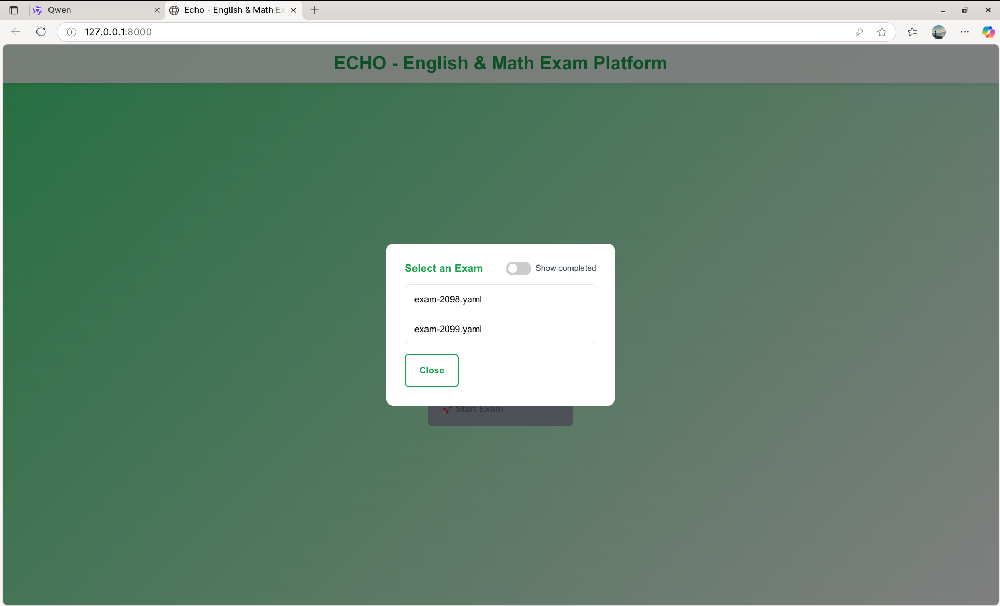
*图5：选择试题页面，可以选择是否显示已完成的试题*

选好试题后，回到主页，可以点击“开始”按钮开始考试。

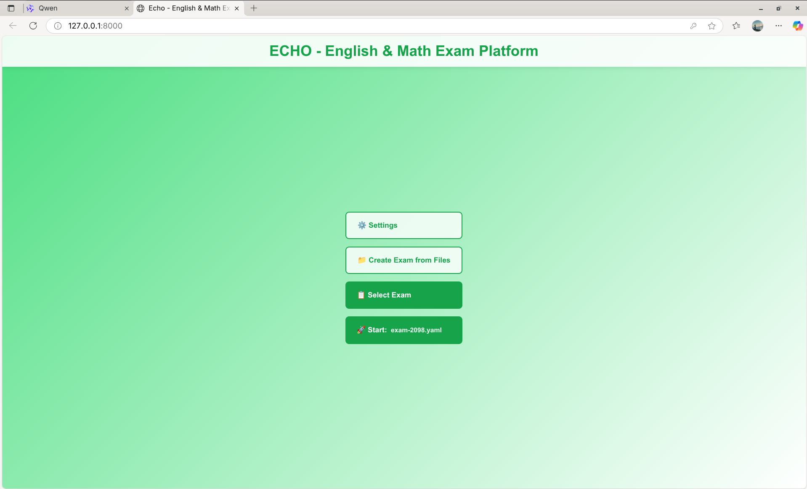
*图6：“开始考试”按钮变绿，可以开始*

#### 步骤1：音频设备测试

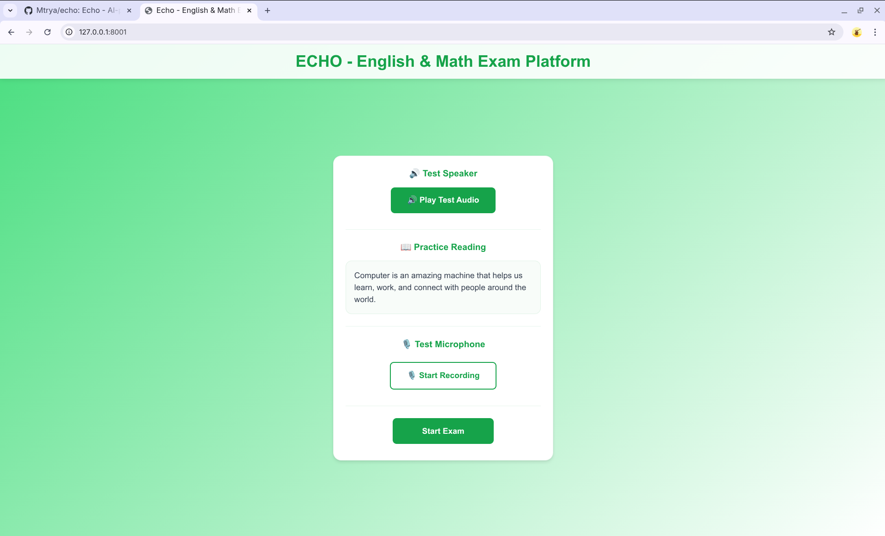
*图7：音频测试页面，确保扬声器 and 麦克风正常工作*

在开始任何考试之前，您需要先进行试音：

1. **扬声器测试**：
   - 点击"播放测试音频"按钮
   - 应该能听到"Hello, this is a test"的语音
   - 如果没有声音，检查电脑音量设置或浏览器音频权限

2. **麦克风测试**：
   - 点击"开始录音"按钮
   - 对着麦克风朗读显示的英文文本
   - 录音结束后可以立即回放录音
   - 确保录音清晰可听

3. **进入考试**：
   - 确认音频设备正常工作后
   - 点击"开始考试"按钮进入正式考试
   - 如果看到“正在生成音频”，请耐心等候

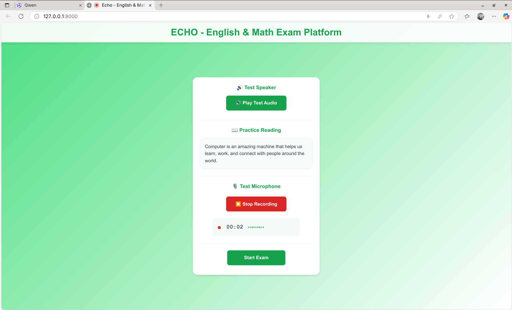
*图8：音频测试界面，正在录音*

#### 步骤2：考试说明页面

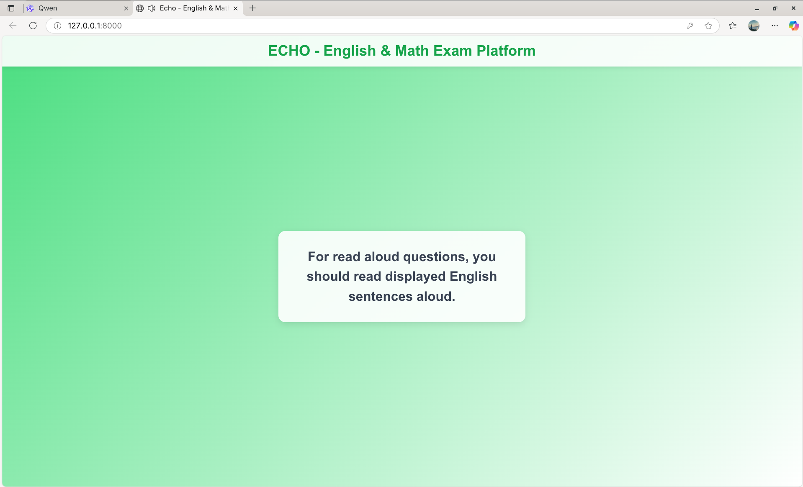
*图9：每个考试部分开始前的说明页面*

每个考试类型开始前，都会显示说明页面：

1. **自动语音说明**：系统会自动朗读考试说明
2. **文字说明**：屏幕上会显示该部分的具体要求
3. **自动进入**：说明播放完毕后自动进入题目

#### 步骤3：四种题型详解

##### 📖 朗读练习

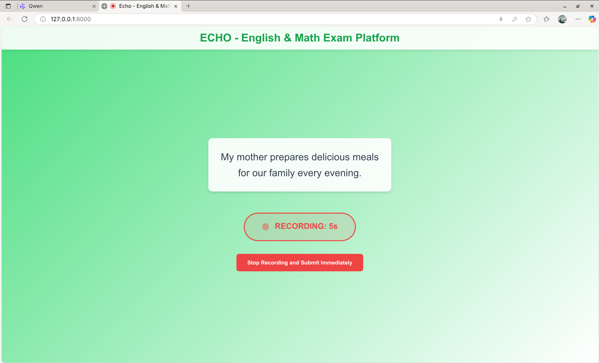
*图10：朗读练习界面，显示需要朗读的英文文本*

**流程**：

1. **显示文本**：屏幕上显示需要朗读的英文句子
2. **准备时间**：3秒倒计时，准备朗读
3. **开始录音**：10秒录音时间，对着麦克风朗读
4. **自动提交**：时间到或点击"完成"按钮提交

##### 🎯 选择题

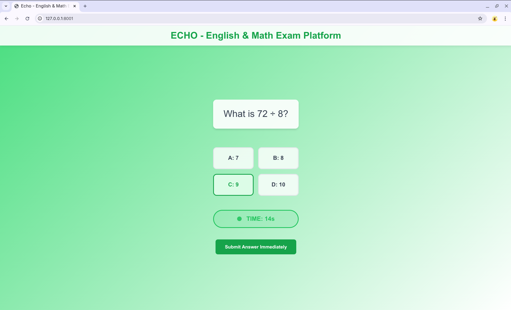
*图11：选择题界面，四个选项供选择*

**流程**：

1. **看问题**：系统会显示题干和四个选项
2. **选择答案**：点击四个选项中的一个
3. **确认选择**：选中的选项会高亮显示
4. **自动提交**：20秒内必须选择答案

##### ⚡ 快速回答

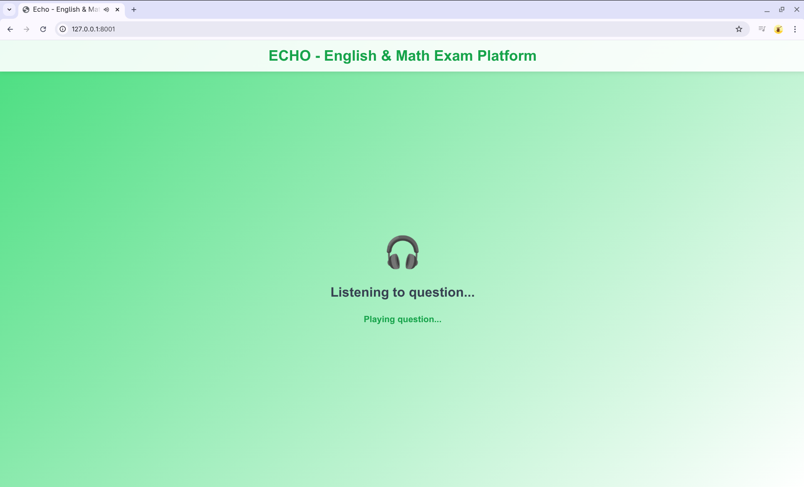
*图12：快速回答界面，听到问题后口头回答*

**流程**：

1. **听问题**：系统播放语音问题
2. **准备回答**：3秒准备时间
3. **录音回答**：10秒录音时间，口头回答问题
4. **自动提交**：时间到自动提交录音

##### 🔄 翻译题

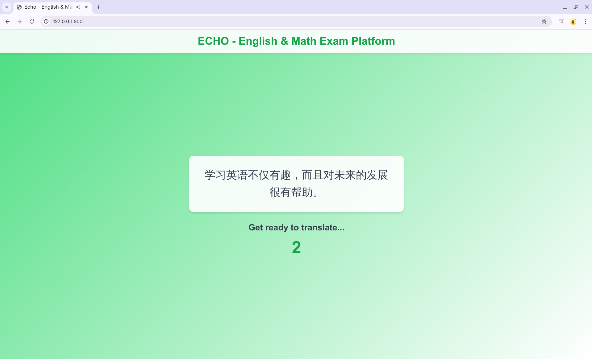
*图13：翻译题界面，看到中文后翻译成英文*

**流程**：

1. **看中文**：屏幕显示中文句子
2. **准备翻译**：3秒准备时间
3. **录音翻译**：20秒录音时间，将中文翻译成英文，并说出来
4. **自动提交**：时间到自动提交录音

#### 步骤4：查看考试结果

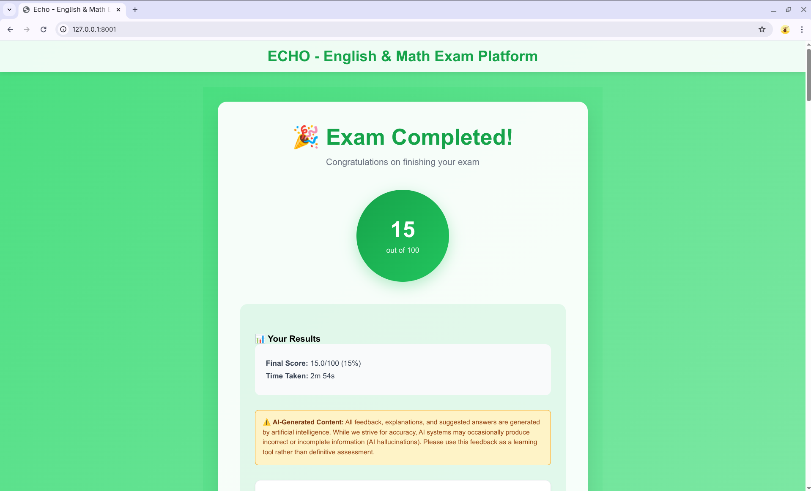
*图14：考试结果页面，显示总分和详细分析*

考试结束后，系统会自动显示详细的成绩分析：

1. **总分显示**：
   - 大的圆形分数显示
   - 百分比形式展示得分率

2. **题目分析**：
   - 每道题的详细评分
   - 可以回放自己的录音
   - AI给出的改进建议

3. **后续操作**：
   - "开始新考试"：继续练习
   - "返回主页"：回到主页面

### 📁 文件转换功能

文件转换是Echo最强大的功能之一，您可以将各种学习材料转换为考试题目。

#### 步骤1：进入文件转换

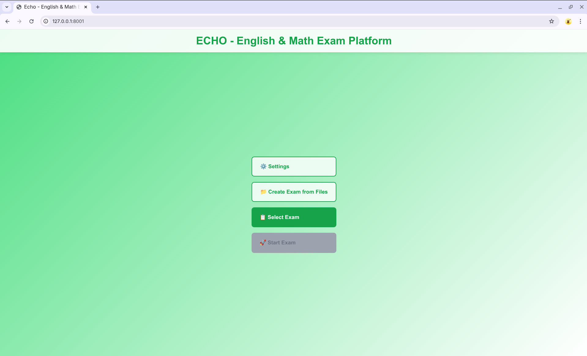
*图15：主页上的文件转换按钮*

1. **点击按钮**：在主页点击"📁 文件转换"按钮
2. **进入页面**：进入文件转换页面

#### 步骤2：上传文件

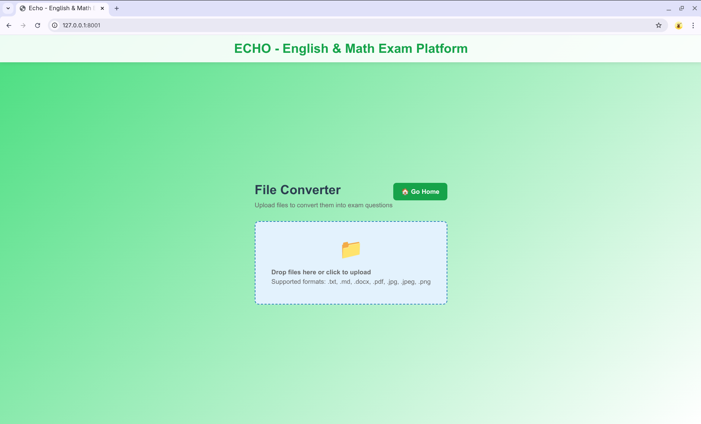
*图16：拖拽或点击上传学习材料文件*

支持多种文件格式：

- **文档类**：.txt, .md, .docx, .pdf
- **图片类**：.jpg, .jpeg, .png

**上传方法**：

1. **拖拽上传**：直接将文件拖拽到虚线框内
2. **点击上传**：点击虚线框内选择文件
3. **批量上传**：可以一次选择多个文件

#### 步骤3：文件转换

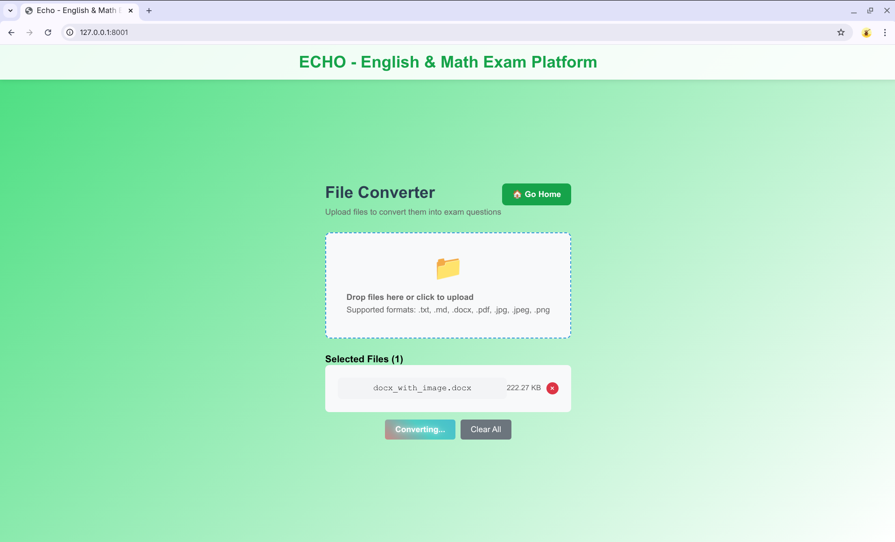
*图17：文件正在AI转换中*

1. **自动识别**：AI会自动识别文件内容
2. **智能分类**：将内容分类为不同的题型
3. **生成考试**：自动生成标准化的考试题目

#### 步骤4：预览和保存

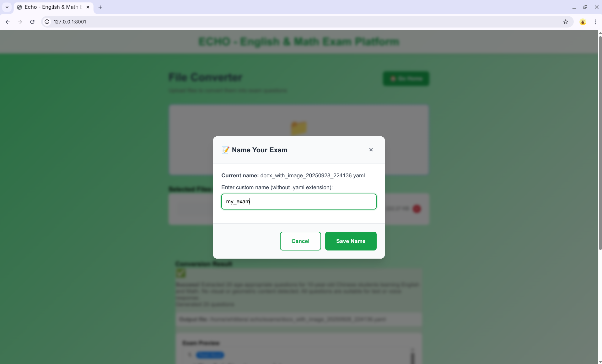
*图18：自定义考试名称，如"my_exam"*

1. **修改名称**：可以自定义考试名称
2. **预览内容**：确定考试名称后，可以检查生成的题目是否正确
3. **删除考试**：考试在生成后自动保存，但如果您对考试内容不满意，可以选择删除考试

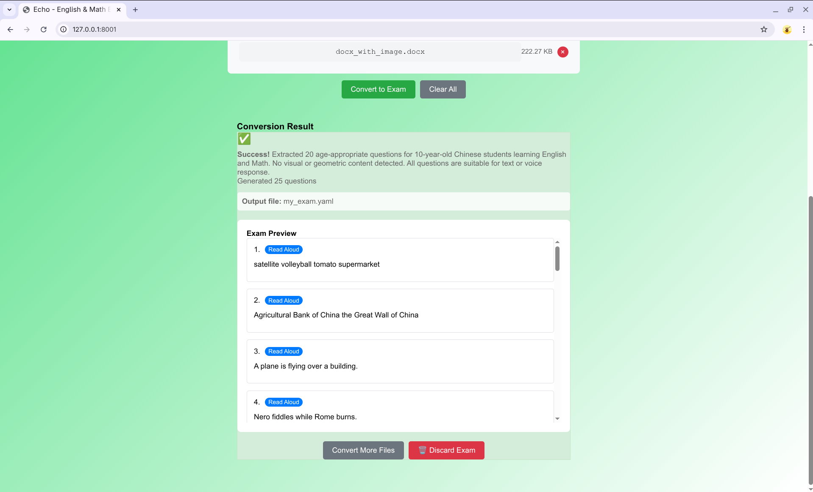
*图19：预览生成的考试题目*

> 💡 **提示**：您可以上传：
>
> - 孩子的作业本照片
> - 英语教材的电子版
> - 练习题的照片
> - 自己整理的学习笔记

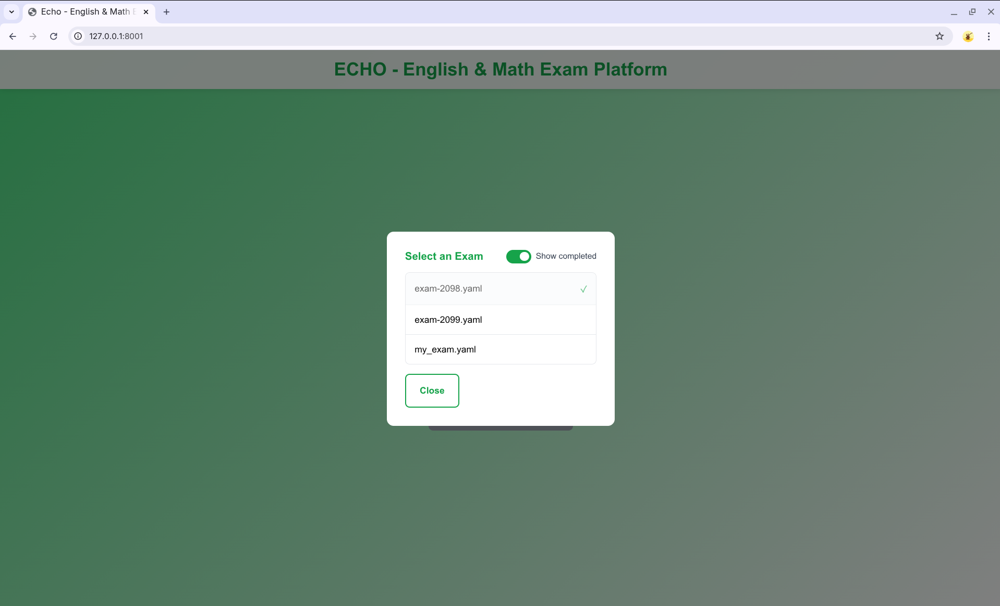
*图20：返回主页后再点击“选择考试”，新生成的试题已出现在选项中*

### 设置管理

点击主页的设置按钮，可以：

**API设置**：

- 更换或重新输入API密钥
- 测试连接状态

**模型设置**：

- 选择不同的AI模型
- 调整语音音色

**计时器设置**：

- 调整每种题目的时间限制
- 适应不同孩子的学习节奏

## 🏗️ 技术实现

### 架构设计

Echo采用前后端分离的现代化架构：

#### 后端技术栈

- **FastAPI**：高性能Web框架，提供自动API文档
- **Pydantic**：数据验证和序列化
- **Dashscope**：AI服务提供商
- **PyInstaller**：打包成可执行文件

#### 前端技术栈

- **Vue.js 3**：现代化的前端框架
- **Vite**：快速的构建工具
- **Web Audio API**：浏览器音频处理
- **HTML5/CSS3**：现代Web标准

### 核心模块

#### 1. 路径管理 (`backend/paths.py`)

- 统一管理跨平台路径
- 支持Linux的 `~/.echo/` 和Windows的 `%APPDATA%\Echo\`
- 自动检测开发环境和生产环境

#### 2. 配置管理 (`backend/config.py`)

- 集中管理所有配置项
- 支持运行时配置更新
- 提供API连接测试功能

#### 3. AI客户端 (`backend/omni_client.py`)

- 统一的AI处理客户端
- 支持文本、音频、图像处理
- 流式API调用避免限流

#### 4. 考试逻辑 (`backend/exam_logic.py`)

- 会话管理和状态跟踪
- 支持渐进式结果处理
- 音频文件缓存管理

#### 5. 文件转换 (`backend/file_conversion.py`)

- 多格式文件解析
- AI驱动的题目提取
- 自动生成考试配置

### 数据流

```data
用户操作 → 前端组件 → API请求 → 后端处理 → AI服务 → 结果返回 → 前端显示
```

### 音频处理

1. **TTS音频**：预先生成并缓存，减少API调用
2. **学生录音**：WebM格式录制，转换为MP3存储
3. **音频播放**：通过静态文件服务提供

## 📁 目录结构

```file
echo/
├── backend/                 # 后端代码
│   ├── main.py              # FastAPI应用入口
│   ├── models.py            # 数据模型
│   ├── omni_client.py       # AI客户端
│   ├── config.py            # 配置管理
│   ├── paths.py             # 路径管理
│   ├── file_conversion.py   # 文件转换
│   └── exam_logic.py        # 考试逻辑
├── frontend/                # 前端代码
│   ├── src/
│   │   ├── components/      # Vue组件
│   │   ├── App.vue          # 主应用
│   │   └── main.js          # 入口文件
│   └── API_DOCUMENTATION.md # API文档
├── exams/                   # 考试文件
├── audio_cache/             # 音频缓存
├── build.py                 # 构建脚本
├── launcher.py              # 启动脚本
└── README.md               # 说明文档
```

## 📄 许可证

本项目采用 MIT 许可证。详见 [LICENSE](LICENSE) 文件。

## 📞 联系方式

如有问题或建议，请通过以下方式联系：

- GitHub Issues：[提交问题](https://github.com/Mtrya/echo/issues)
- 邮箱：<erchanmion20@outlook.com>

## 🙏 致谢

感谢以下开源项目和技术支持：

### 开源项目

- [FastAPI](https://fastapi.tiangolo.com/) - 现代化的Web框架
- [Vue.js](https://vuejs.org/) - 渐进式JavaScript框架

### AI服务与工具

- **Dashscope** - 提供强大的AI API服务支持
- **Claude Code** - 可靠的编程伙伴，几乎所有的前端代码都完全由vibe coding生成
- **Qwen团队** - 提供了强大的模型支持：
  - **qwen3-omni-flash** - 全模态模型，用于语音合成和评分
  - **qwen3-vl-plus** - 视觉语言模型，用于文件转换
  - **qwen3-coder-plus** - 代码模型，作为Claude Code的后端
  - **qwen-image & qwen-image-edit** - 图像生成与编辑，帮助生成项目icon以及编辑README插图

### 特别感谢

- **PFLS（我的中学）和老师们** - 在浦外的7年中学时光总体而言是美好而轻松的，感谢学校这种“不卷”的氛围；感谢认真负责的老师们对我的培养。

---

**Echo** - 让学习更智能，让成长更快乐！ 🎓✨
